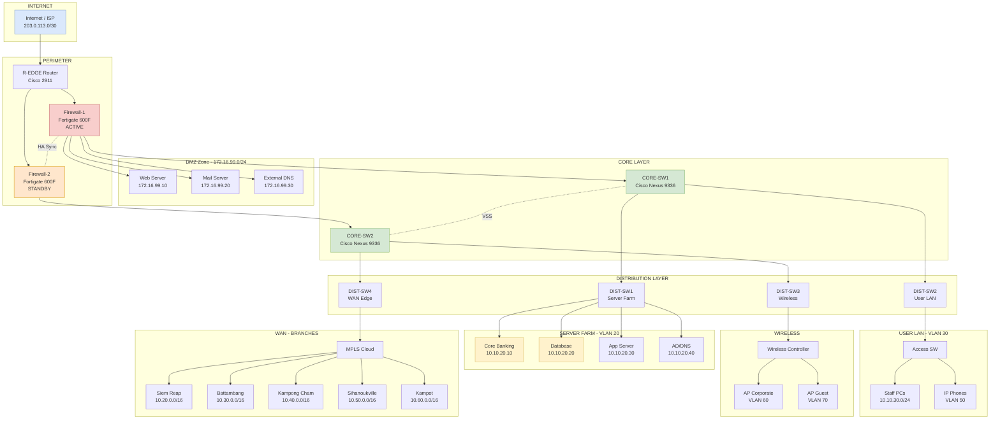
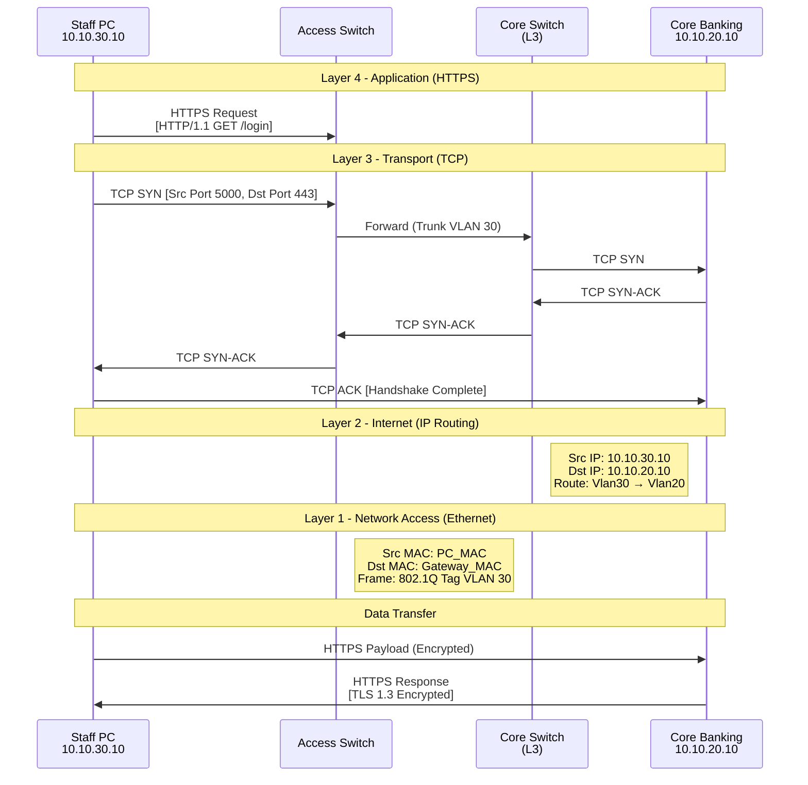
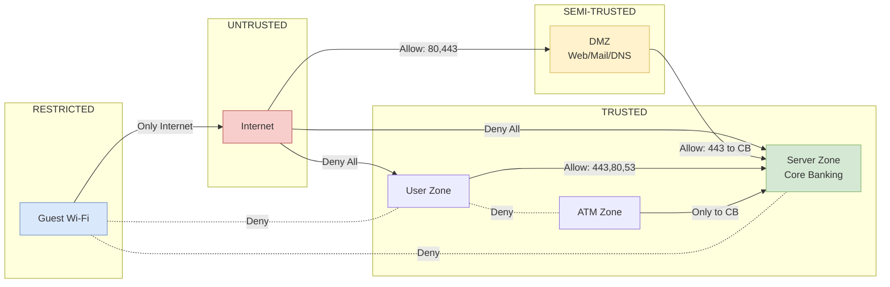
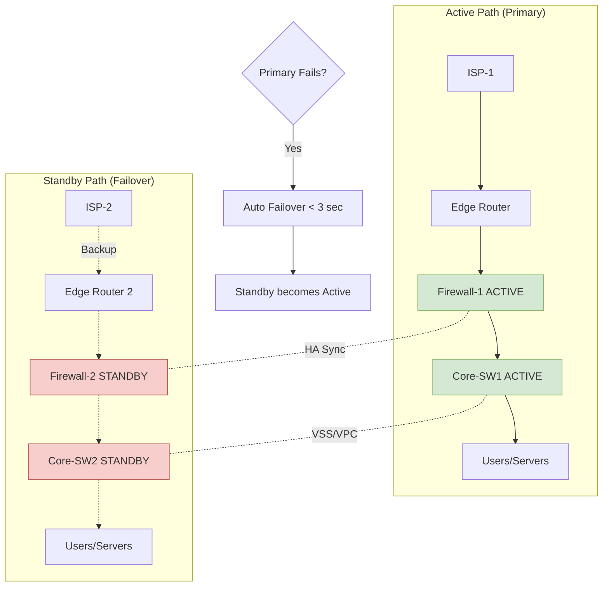
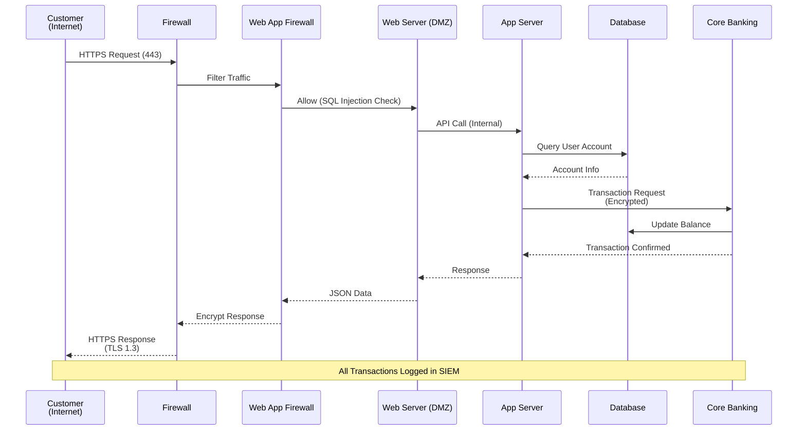
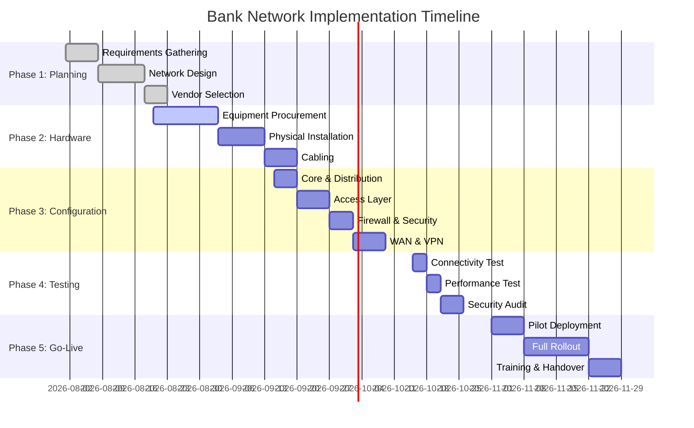

# Network Flow Diagrams
## ដ្យាក្រាមលំហូរបណ្តាញធនាគារ (Visual Representation)

---

## ១. Logical Network Topology (Mermaid)



---

## ២. Packet Flow Diagram — TCP/IP Layers

### ២.១ Data Flow: Staff PC ↔ Core Banking Server



---

## ៣. VLAN Segmentation Diagram

```
+----------------------------------------------------------+
|                     CORE SWITCH                          |
|                  (Inter-VLAN Routing)                    |
+----------------------------------------------------------+
        |         |         |         |         |
        v         v         v         v         v
   +--------+ +--------+ +--------+ +--------+ +--------+
   | VLAN10 | | VLAN20 | | VLAN30 | | VLAN40 | | VLAN60 |
   |  MGMT  | | SERVER | | STAFF  | |  ATM   | |WIFI-CP |
   |        | |        | |        | |        | |        |
   |10.10.  | |10.10.  | |10.10.  | |10.10.  | |10.10.  |
   |10.0/24 | |20.0/24 | |30.0/24 | |40.0/24 | |60.0/24 |
   +--------+ +--------+ +--------+ +--------+ +--------+
        |         |         |         |         |
     Admin     Core       PCs       ATM     Corporate
     Access    Banking    IP Phones Machines Wi-Fi
              Database
```

---

## ៤. Security Zone Flow



---

## ៥. WAN / Branch Connectivity Flow

```
                    HEAD OFFICE (ភ្នំពេញ)
                    ┌─────────────────────┐
                    │  R-EDGE (2911)      │
                    │  BGP AS 65001       │
                    └──────────┬──────────┘
                               │
                    ┌──────────┴──────────┐
                    │   MPLS Provider     │
                    │   (Metfone/Cellcard)│
                    └──────────┬──────────┘
                               │
        ┌───────────┬──────────┼──────────┬────────────┐
        │           │          │          │            │
   ┌────┴────┐ ┌───┴───┐ ┌────┴────┐ ┌───┴────┐ ┌────┴────┐
   │  R-SR   │ │ R-BB  │ │  R-KC   │ │  R-SH  │ │  R-KP   │
   │ សៀមរាប  │ │បាត់ដំបង│ │កំពង់ចាម │ │ព្រះសីហនុ│ │  កំពត   │
   │10.20/16 │ │10.30/16│ │10.40/16 │ │10.50/16│ │10.60/16 │
   └─────────┘ └───────┘ └─────────┘ └────────┘ └─────────┘

   Primary Link: MPLS (Metfone Business - 100 Mbps)
   Backup Link:  4G/LTE (Automatic Failover < 30s)
   VPN: IPsec Site-to-Site (AES-256, SHA-256)
```

---

## ៦. High Availability Flow



---

## ៧. Data Flow - Internet Banking Transaction



---

## ៨. Physical Rack Layout (Head Office Data Center)

```
┌─────────────────────────────────────┐
│         RACK 1 (Network)            │
├─────────────────────────────────────┤
│ U42 │ [CABLE MGMT]                  │
│ U41 │ [PATCH PANEL 48-port]         │
│ U40 │ [PATCH PANEL 48-port]         │
│ U39 │ [EDGE ROUTER - Cisco ASR]     │
│ U38 │ [FIREWALL-1 - Fortigate 600F] │
│ U37 │ [FIREWALL-2 - Fortigate 600F] │
│ U36 │ [CORE-SW1 - Nexus 9336]       │
│ U35 │ [CORE-SW2 - Nexus 9336]       │
│ U34 │ [DIST-SW1 - Catalyst 9500]    │
│ U33 │ [DIST-SW2 - Catalyst 9500]    │
│ U32 │ [DIST-SW3 - Catalyst 9500]    │
│ U31 │ [DIST-SW4 - Catalyst 9500]    │
│ U30 │ [WLC - Wireless Controller]   │
│ ... │ ...                           │
│ U2  │ [UPS - APC Smart-UPS 3000]    │
│ U1  │ [PDU]                         │
└─────────────────────────────────────┘

┌─────────────────────────────────────┐
│         RACK 2 (Servers)            │
├─────────────────────────────────────┤
│ U42 │ [KVM Console]                 │
│ U40 │ [Core Banking Server]         │
│ U38 │ [Database Server (Primary)]   │
│ U36 │ [Database Server (Backup)]    │
│ U34 │ [Application Server]          │
│ U32 │ [AD / DNS Server]             │
│ U30 │ [Backup Server]               │
│ U28 │ [SIEM Server (Splunk)]        │
│ ... │ ...                           │
│ U2  │ [UPS]                         │
└─────────────────────────────────────┘
```

---

## ៩. TCP/IP Encapsulation Flow

```
Application Layer:  [   HTTP/HTTPS Data   ]
                            ↓
Transport Layer:    [ TCP Header | Data ]
                            ↓
Internet Layer:     [ IP Header | TCP | Data ]
                            ↓
Network Access:     [ Ethernet | IP | TCP | Data | FCS ]
                            ↓
                    ┌─────────────────────┐
                    │  Physical Medium    │
                    │  (Fiber/Copper)     │
                    └─────────────────────┘
```

### ឧទាហរណ៍ Packet ដែលកំពុងឆ្លងកាត់ (Real Data):

```
┌──────────────────────────────────────────────────┐
│ Ethernet Frame                                    │
│ ┌──────────────────────────────────────────────┐ │
│ │ Dst MAC: 00:1A:2B:3C:4D:5E                  │ │
│ │ Src MAC: 00:1F:2E:3D:4C:5B                  │ │
│ │ Type: 0x0800 (IPv4)                          │ │
│ │ VLAN Tag: 802.1Q, ID=30                      │ │
│ │ ┌────────────────────────────────────────┐   │ │
│ │ │ IP Header                              │   │ │
│ │ │ Version: 4  |  IHL: 20  |  TTL: 64    │   │ │
│ │ │ Src IP: 10.10.30.10                    │   │ │
│ │ │ Dst IP: 10.10.20.10                    │   │ │
│ │ │ Protocol: 6 (TCP)                      │   │ │
│ │ │ ┌──────────────────────────────────┐   │   │ │
│ │ │ │ TCP Header                       │   │   │ │
│ │ │ │ Src Port: 54321                  │   │   │ │
│ │ │ │ Dst Port: 443 (HTTPS)            │   │   │ │
│ │ │ │ Flags: [SYN]                     │   │   │ │
│ │ │ │ ┌────────────────────────────┐   │   │   │ │
│ │ │ │ │  Application Data (TLS)    │   │   │   │ │
│ │ │ │ │  Encrypted Payload         │   │   │   │ │
│ │ │ │ └────────────────────────────┘   │   │   │ │
│ │ │ └──────────────────────────────────┘   │   │ │
│ │ └────────────────────────────────────────┘   │ │
│ │ FCS (Frame Check Sequence)                    │ │
│ └──────────────────────────────────────────────┘ │
└──────────────────────────────────────────────────┘
```

---

## ១០. Implementation Timeline (Gantt-style)



---

## ១១. របៀបបើកឯកសារ

### Draw.io / Visio File (`Network_Topology.drawio`):
1. ចូល https://app.diagrams.net (ឥតគិតថ្លៃ)
2. File → Open From → Device → ជ្រើសរើស `Network_Topology.drawio`
3. **Export ជា Visio**: File → Export as → VSDX
4. **Export ជា PNG/PDF**: File → Export as → PNG/PDF

### Mermaid Diagrams (ក្នុងឯកសារនេះ):
- បើកជា Markdown Viewer (VS Code, GitHub, Typora)
- ដ្យាក្រាមនឹង Render ដោយស្វ័យប្រវត្តិ
- Online: https://mermaid.live

### Packet Tracer Lab:
- អនុវត្តតាមឯកសារ `PacketTracer_Lab_Guide.md`
- Save ជា `Bank_Enterprise_Network.pkt`

---

**រៀបចំដោយ**: ក្រុមវិស្វករប្រព័ន្ធ
**កាលបរិច្ឆេទ**: ថ្ងៃទី ១៩ សីហា ២០២៦
