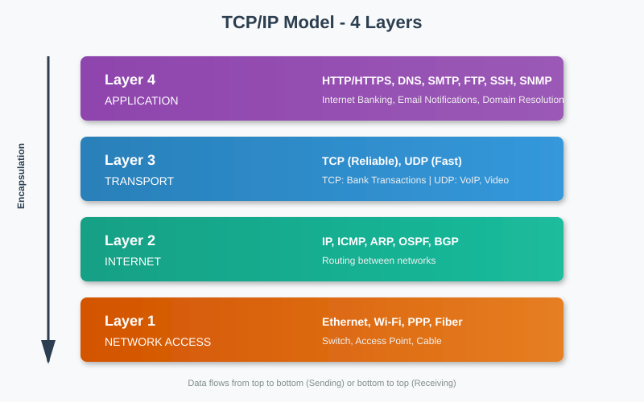
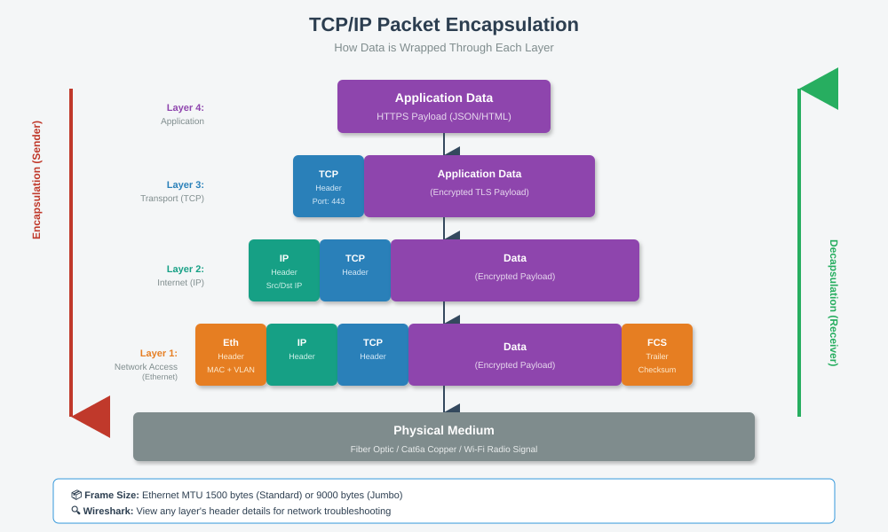

# 🌐 គំរូ TCP/IP (TCP/IP Model)

[⬅ Back to Index](index.md)

---

## 📐 4 Layers



**TCP/IP Model** មាន ៤ ស្រទាប់ សម្រាប់ការទំនាក់ទំនងកុំព្យូទ័រតាមបណ្តាញ។

---

## 🔍 មុខងារនីមួយៗ

### Layer 4: Application (ស្រទាប់កម្មវិធី)
- **Protocols**: HTTP, HTTPS, FTP, DNS, SMTP
- **ការប្រើ**: Web Browser, Email, File Transfer
- **ឧទាហរណ៍**: បើក `www.google.com` → HTTP

### Layer 3: Transport (ស្រទាប់ដឹកជញ្ជូន)
- **Protocols**: TCP, UDP
- **TCP** — ភាពជឿជាក់ខ្ពស់ (សម្រាប់ Web, Email)
- **UDP** — លឿន (សម្រាប់ Video, Voice)

### Layer 2: Internet (ស្រទាប់អ៊ិនធឺណិត)
- **Protocol**: IP (IPv4)
- **មុខងារ**: បញ្ជូន Packet តាម IP Address
- **ឧទាហរណ៍**: 192.168.1.1 → 8.8.8.8

### Layer 1: Network Access (ស្រទាប់តភ្ជាប់)
- **Protocols**: Ethernet, Wi-Fi
- **ឧបករណ៍**: Cable, Switch, Access Point
- **ឧទាហរណ៍**: MAC Address, Ethernet Frame

---

## 🔄 TCP/IP vs OSI Model

| TCP/IP (4 Layers) | OSI (7 Layers) | ឧទាហរណ៍ |
|:------------------:|:--------------:|:---------|
| Application | Application, Presentation, Session | HTTP, DNS |
| Transport | Transport | TCP, UDP |
| Internet | Network | IP |
| Network Access | Data Link, Physical | Ethernet |

**ហេតុអ្វី TCP/IP?** សាមញ្ញជាង OSI និងប្រើក្នុង Internet ជាក់ស្តែង។

---

## 📦 Packet Encapsulation



**Encapsulation** = ដំណើរការ "រុំ" ទិន្នន័យតាមស្រទាប់នីមួយៗ៖

```
Data → Segment → Packet → Frame → Bits
(App) → (TCP) → (IP)   → (Eth)  → (Wire)
```

---

## 💡 ចំណុចសំខាន់សម្រាប់និស្សិត

- 🎯 គ្រប់ Device (PC, Router, Server) ប្រើ TCP/IP
- 🎯 Web Browser ប្រើ HTTP/HTTPS (Layer 4)
- 🎯 Router ធ្វើការនៅ Layer 2 (IP)
- 🎯 Switch ធ្វើការនៅ Layer 1 (MAC/Frame)

---

[⬅ Prev: Requirements](02_requirements.md) | [Index](index.md) | [Next: Architecture ➡](04_architecture.md)
