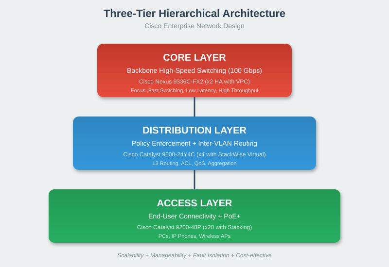

# 🏗️ Network Architecture

[⬅ Back to Index](index.md)

---

## 📐 Three-Tier Design (មូលដ្ឋាន)



យើងប្រើប្រាស់ **Three-Tier Design** ដែលជាគំរូ Cisco Standard សម្រាប់សហគ្រាស។

---

## 🎯 មុខងារនីមួយៗ

### 🔷 Core Layer (ស្រទាប់កណ្តាល)
- **មុខងារ**: ភ្ជាប់រវាង Distribution Switches ដោយ **ល្បឿនលឿន**
- **ឧបករណ៍**: Cisco Switch (ឧ. Catalyst 3560)
- **គោលដៅ**: High-speed switching, low latency

### 🔷 Distribution Layer (ស្រទាប់ចែកចាយ)
- **មុខងារ**: **Routing** ចាប់សម្រាប់ VLAN និង Policy
- **ឧបករណ៍**: Layer 3 Switch (ឧ. Catalyst 3560)
- **គោលដៅ**: Inter-VLAN routing, ACL

### 🔷 Access Layer (ស្រទាប់តភ្ជាប់អ្នកប្រើ)
- **មុខងារ**: ភ្ជាប់ **PC, Printer, IP Phone** ចូលបណ្តាញ
- **ឧបករណ៍**: Cisco Catalyst 2960
- **គោលដៅ**: End-user connectivity, PoE

---

## ✅ ហេតុអ្វីត្រូវប្រើ 3-Tier?

| ចំណុច | អត្ថប្រយោជន៍ |
|-------|--------------|
| **Scalability** | អាចបន្ថែម Switch ថ្មីបានងាយ |
| **Manageability** | ងាយក្នុងការគ្រប់គ្រង និង Troubleshoot |
| **Fault Isolation** | ប្រសិន Switch មួយខូច មិនប៉ះពាល់ដល់ទាំងអស់ |
| **Performance** | Traffic បែងចែកតាមស្រទាប់ |

---

## 🔀 សម្រាប់សាខាតូច (Small Branch)

សម្រាប់សាខាតូច យើងអាចប្រើ **2-Tier** (Collapsed Core)៖

```
   [ Router + Firewall ]
           │
     [ Switch (L2/L3) ]
           │
   ┌───────┼───────┐
  PC     Printer  IP Phone
```

**គ្រប់គ្រាន់** សម្រាប់សាខាដែលមានអ្នកប្រើតិចជាង ៥០ នាក់។

---

[⬅ Prev: TCP/IP](03_tcpip_model.md) | [Index](index.md) | [Next: Logical Topology ➡](05_logical_topology.md)
