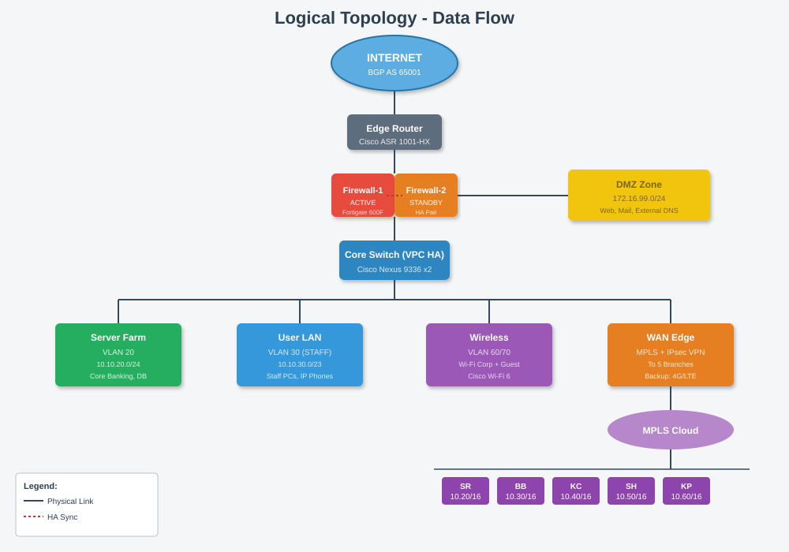
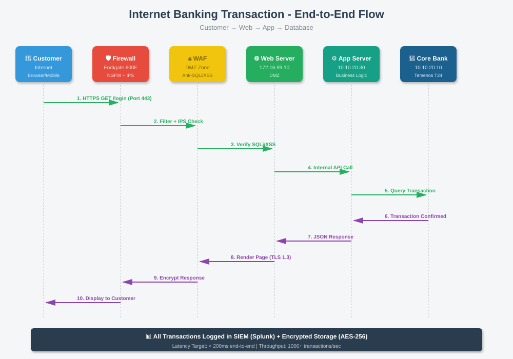

# 🖼️ Logical Topology

[⬅ Back to Index](index.md)

---

## 📊 Diagram



**Logical Topology** បង្ហាញរបៀបដែល **ទិន្នន័យធ្វើដំណើរ** តាម Network — មិនផ្តោតលើទីតាំងឧបករណ៍ជាក់ស្តែងទេ។

---

## 🌐 Zones (តំបន់ដាច់ដោយឡែក)

| Zone | ការប្រើ | Trust Level |
|------|---------|-------------|
| **Internet** | ខាងក្រៅ | Untrusted |
| **DMZ** | Web Server, Mail | Semi-Trusted |
| **Server** | ធនាគារ Server | Trusted |
| **User** | Staff PC | Trusted |
| **ATM** | ATM Machines | Restricted |

---

## 🔄 Data Flow Example

### Staff → File Server:
```
Staff PC (192.168.30.10)
    ↓ (Ethernet + VLAN 30)
Access Switch
    ↓ (Trunk to Core)
Core Switch (Inter-VLAN Routing)
    ↓ (VLAN 30 → VLAN 20)
File Server (192.168.20.10)
```

---

### Customer → Web Banking:



---

## 🎯 លក្ខណៈពិសេស

- ✅ **VLAN Segmentation** — បំបែក Traffic
- ✅ **Firewall** — ការពារពី Internet
- ✅ **Routing** (Static + OSPF) — សម្រាប់ Multi-VLAN
- ✅ **VPN** — សម្រាប់ភ្ជាប់សាខា

---

[⬅ Prev: Architecture](04_architecture.md) | [Index](index.md) | [Next: Physical Topology ➡](06_physical_topology.md)
