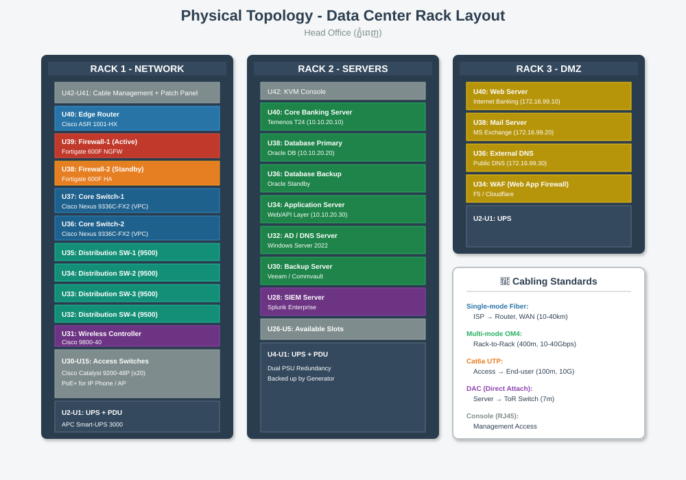

# 🏢 Physical Topology

[⬅ Back to Index](index.md)

---

## 📊 Rack Layout



**Physical Topology** = ទីតាំងជាក់ស្តែងនៃ Router, Switch, Server នៅក្នុងបន្ទប់ Server (Data Center)។

---

## 🏬 Head Office - Server Room

### 📦 Rack 1: Network Equipment
- **Router**: Cisco 2911 (សម្រាប់ Internet + WAN)
- **Firewall**: Cisco ASA 5506-X ឬ pfSense
- **Core Switch**: Cisco Catalyst 3560
- **Access Switch**: Cisco Catalyst 2960 (x2)
- **UPS**: APC 1500 VA

### 📦 Rack 2: Servers
- **File Server**: Windows Server 2022
- **DNS Server**: BIND ឬ Windows DNS
- **Database Server**: MySQL / SQL Server
- **Web Server (Internal)**: Apache/Nginx

---

## 🏬 Branch Office

**សាខាតូច** ត្រូវការតែៈ

```
    ISP Modem
       │
   Cisco Router 1941
       │
   Firewall (Small)
       │
   Switch 2960
       │
   ┌───┼───┐
  PC  ATM  Printer
```

---

## 🔌 Cable Types (ខ្សែបណ្តាញ)

| ខ្សែ | ការប្រើ | ចម្ងាយ | ល្បឿន |
|------|---------|--------|-------|
| **Cat6 UTP** | Server, PC | 100 m | 1 Gbps |
| **Cat5e UTP** | PC, Printer | 100 m | 1 Gbps |
| **Fiber Optic (Multi-mode)** | Rack ↔ Rack | 500 m | 10 Gbps |
| **Console Cable** | Router/Switch Management | 3 m | - |

---

## ⚡ Power & Cooling

- **UPS** — ការពារពី Power outage (~30 នាទី backup)
- **Air Conditioner** — រក្សា Temperature ~22°C
- **Fire Alarm** — សុវត្ថិភាព

---

[⬅ Prev: Logical Topology](05_logical_topology.md) | [Index](index.md) | [Next: WAN Topology ➡](07_wan_topology.md)
