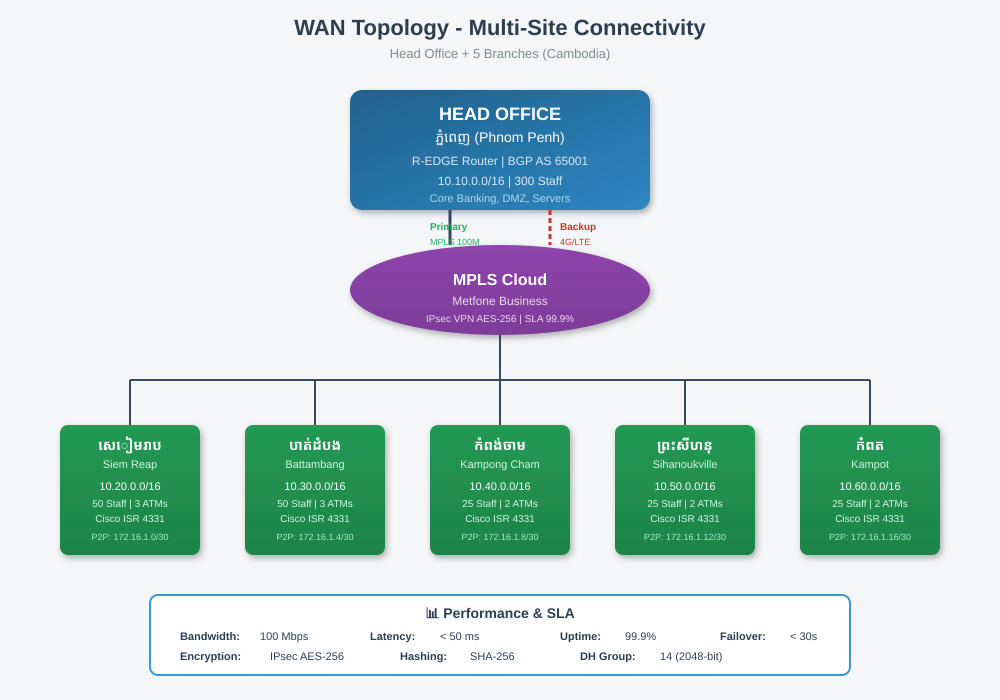

# 🌏 WAN Topology (ការតភ្ជាប់សាខា)

[⬅ Back to Index](index.md)

---

## 📊 Diagram



**WAN (Wide Area Network)** = បណ្តាញភ្ជាប់សាខាទាំងអស់ជាមួយ Head Office។

---

## 🔗 Connectivity

| Branch | Location | Link Type | Bandwidth |
|--------|----------|-----------|-----------|
| Head Office | ភ្នំពេញ | Fiber Internet | 100 Mbps |
| សៀមរាប | Siem Reap | VPN over Internet | 20 Mbps |
| បាត់ដំបង | Battambang | VPN over Internet | 20 Mbps |
| ព្រះសីហនុ | Sihanoukville | VPN over Internet | 20 Mbps |

---

## 🔒 VPN (Virtual Private Network)

យើងប្រើ **Site-to-Site VPN** ដើម្បីភ្ជាប់សាខាតាមរយៈ Internet ដោយសុវត្ថិភាព។

### របៀបដំណើរការ:

```
Head Office ─── Internet ─── Branch
     │                            │
     └──── Encrypted Tunnel ──────┘
           (IPsec VPN)
```

- **Encryption**: IPsec ជាមួយ AES-128
- **Authentication**: Pre-shared Key ឬ Certificate
- **Cost**: ថោកជាង MPLS

---

## 🌐 IP សម្រាប់ WAN Link

| Link | Subnet | HO IP | Branch IP |
|------|--------|-------|-----------|
| HO ↔ សៀមរាប | 10.0.0.0/30 | 10.0.0.1 | 10.0.0.2 |
| HO ↔ បាត់ដំបង | 10.0.0.4/30 | 10.0.0.5 | 10.0.0.6 |
| HO ↔ ព្រះសីហនុ | 10.0.0.8/30 | 10.0.0.9 | 10.0.0.10 |

**ហេតុអ្វី /30?** មាន IP ត្រឹមតែ ២ ដែលអាចប្រើបាន — ល្មមសម្រាប់ P2P Link។

---

## ⚡ Performance Target

| Metric | Target |
|--------|--------|
| **Bandwidth** | 20 Mbps ក្នុងសាខានីមួយៗ |
| **Latency** | < 100 ms |
| **Uptime** | 99% |
| **Encryption** | AES-128 (IPsec) |

---

## 🔄 Backup Plan

- **Primary Link**: Fiber Internet
- **Backup Link**: 4G Router (Optional)
- បើ Internet ដាច់ → ប្តូរទៅ 4G ដោយស្វ័យប្រវត្តិ

---

[⬅ Prev: Physical Topology](06_physical_topology.md) | [Index](index.md) | [Next: IP Addressing ➡](08_ip_addressing.md)
