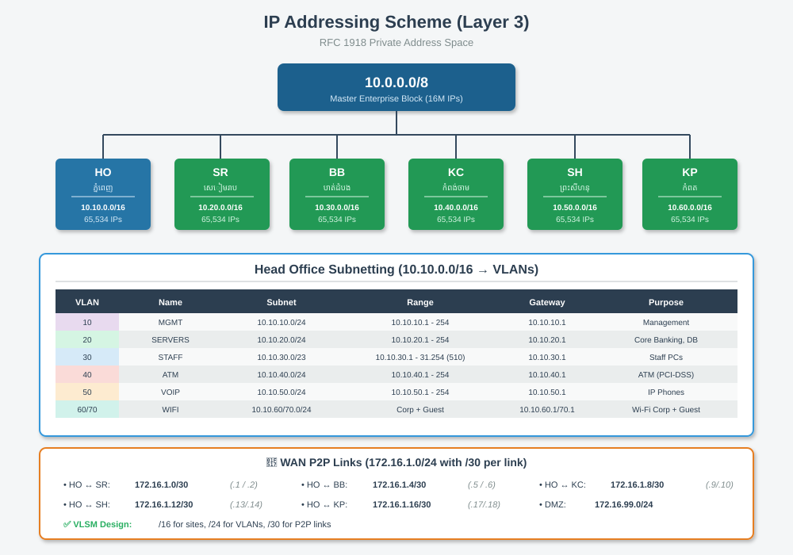

# 🔢 IP Addressing (Layer 3)

[⬅ Back to Index](index.md)

---

## 📐 Master Plan

យើងប្រើ **Private IP** តាម RFC 1918 (192.168.x.x):



---

## 🏢 Site Assignment

| ទីតាំង | Subnet | Hosts | Gateway |
|--------|--------|-------|---------|
| Head Office | 192.168.10.0/24 | 254 | 192.168.10.1 |
| សៀមរាប | 192.168.20.0/24 | 254 | 192.168.20.1 |
| បាត់ដំបង | 192.168.30.0/24 | 254 | 192.168.30.1 |
| ព្រះសីហនុ | 192.168.40.0/24 | 254 | 192.168.40.1 |
| WAN Links | 10.0.0.0/24 | (/30 subnets) | - |
| DMZ | 172.16.99.0/24 | 254 | 172.16.99.1 |

---

## 🔍 Head Office - VLAN Subnetting

| VLAN | Name | Subnet | Purpose |
|------|------|--------|---------|
| 10 | STAFF | 192.168.10.0/24 | បុគ្គលិក PC |
| 20 | SERVER | 192.168.20.0/24 | Server ធនាគារ |
| 30 | VOIP | 192.168.30.0/24 | IP Phone |
| 40 | GUEST | 192.168.40.0/24 | Wi-Fi សម្រាប់អតិថិជន |

---

## 💡 Public vs Private IP

| Type | Range | Use |
|------|-------|-----|
| **Private** | 10.x, 172.16-31.x, 192.168.x | ក្នុងបណ្តាញ (Internal) |
| **Public** | ផ្សេងទៀត | Internet-facing |

**បណ្តាញ Internal** ប្រើ Private IP + **NAT** (Network Address Translation) ដើម្បីចេញ Internet។

---

## 🔀 NAT (Network Address Translation)

```
Staff PC (192.168.10.10) 
    ↓
Router (NAT)
    ↓
Internet (Router's Public IP: 203.0.113.5)
    ↓
Google Server (8.8.8.8)
```

Router បំប្លែង Private IP ទៅ Public IP នៅពេលចេញ Internet។

---

## 🎓 Subnet Basics សម្រាប់និស្សិត

| Prefix | Mask | Hosts |
|--------|------|-------|
| /24 | 255.255.255.0 | 254 |
| /25 | 255.255.255.128 | 126 |
| /26 | 255.255.255.192 | 62 |
| /27 | 255.255.255.224 | 30 |
| /30 | 255.255.255.252 | 2 (សម្រាប់ P2P) |

**រូបមន្ត**: Hosts = 2^(32-prefix) - 2

---

[⬅ Prev: WAN Topology](07_wan_topology.md) | [Index](index.md) | [Next: VLAN Design ➡](09_vlan_design.md)
