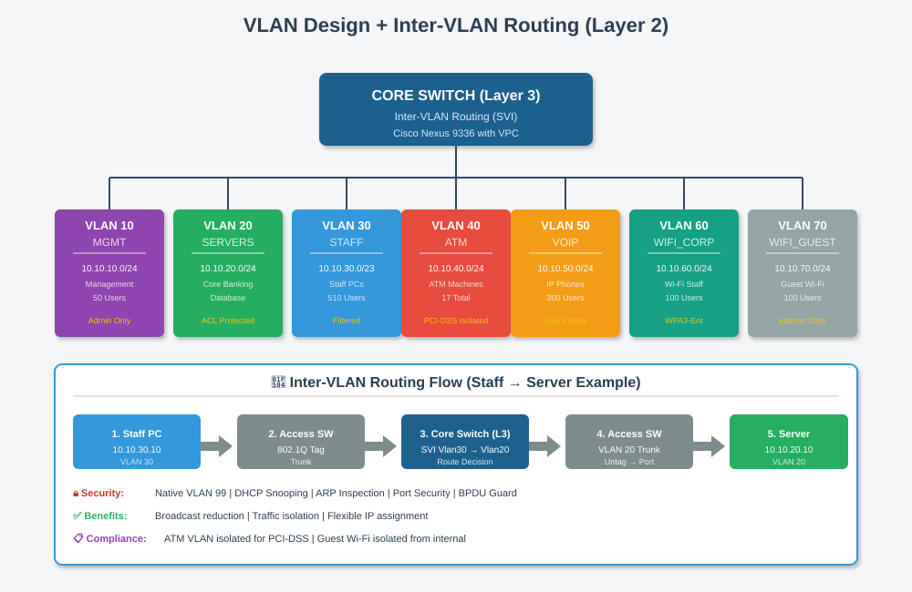

# 🏷️ VLAN Design (Layer 2)

[⬅ Back to Index](index.md)

---

## 📊 VLAN Overview



**VLAN (Virtual LAN)** = ការបំបែក Switch ១ ទៅជាបណ្តាញឡូជីខលច្រើន។

---

## 📋 VLAN Table (Head Office)

| VLAN ID | Name | Subnet | Purpose |
|:-------:|:----:|:-------|:--------|
| 10 | STAFF | 192.168.10.0/24 | បុគ្គលិក PC |
| 20 | SERVER | 192.168.20.0/24 | ធនាគារ Server |
| 30 | VOIP | 192.168.30.0/24 | IP Phone |
| 40 | GUEST | 192.168.40.0/24 | Wi-Fi សម្រាប់អតិថិជន |

**៤ VLANs គ្រប់គ្រាន់** សម្រាប់ការចាប់ផ្តើម។

---

## ✅ ហេតុអ្វីត្រូវប្រើ VLAN?

| ចំណុច | ការពិពណ៌នា |
|-------|-------------|
| **សុវត្ថិភាព** | Guest មិនអាចមើលឃើញ Staff PC |
| **Performance** | កាត់បន្ថយ Broadcast Traffic |
| **Organization** | បំបែកតាមមុខងារ |
| **Cost Saving** | ប្រើ Switch ១ សម្រាប់ VLAN ច្រើន |

---

## 🔗 Port Types

### Access Port (Port ភ្ជាប់ជាមួយ Device)
- Assign តែ **VLAN ១** ប៉ុណ្ណោះ
- ឧទាហរណ៍: Port 1 → VLAN 10 (Staff)

### Trunk Port (Port ភ្ជាប់ Switch ↔ Switch)
- ដឹក **VLAN ច្រើន**
- ប្រើ **802.1Q Tag** ដើម្បីសម្គាល់ VLAN

---

## 🔄 Inter-VLAN Routing

**បញ្ហា**: PC នៅ VLAN 10 ចង់និយាយជាមួយ Server នៅ VLAN 20 — VLAN ដាច់ដោយឡែក!

**ដំណោះស្រាយ**: ប្រើ **Router** ឬ **Layer 3 Switch** សម្រាប់ Route រវាង VLANs។

```
PC (VLAN 10) → Access Switch → Trunk → 
Core Switch (L3) → Route → Server (VLAN 20)
```

---

## 💻 Configuration Example (Cisco)

```cisco
! Create VLAN
Switch(config)# vlan 10
Switch(config-vlan)# name STAFF
Switch(config-vlan)# exit

! Assign Access Port
Switch(config)# interface fa0/1
Switch(config-if)# switchport mode access
Switch(config-if)# switchport access vlan 10

! Configure Trunk
Switch(config)# interface gi0/1
Switch(config-if)# switchport mode trunk
Switch(config-if)# switchport trunk allowed vlan 10,20,30,40

! Inter-VLAN Routing (SVI on L3 Switch)
Switch(config)# interface vlan 10
Switch(config-if)# ip address 192.168.10.1 255.255.255.0
Switch(config-if)# no shutdown
```

---

## 🔒 Security Best Practices

1. **មិនប្រើ VLAN 1** (default) — ប្តូរទៅ VLAN 99
2. **Disable Port ដែលមិនប្រើ** — ការពារ Unauthorized Access
3. **Port Security** — Limit MAC Address ក្នុង Port
4. **VLAN Segregation** — Guest ដាច់ដោយឡែកពី Staff

---

[⬅ Prev: IP Addressing](08_ip_addressing.md) | [Index](index.md) | [Next: Routing ➡](10_routing.md)
