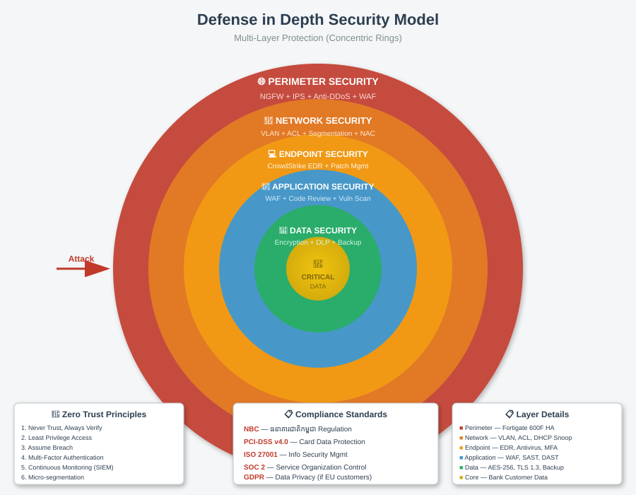
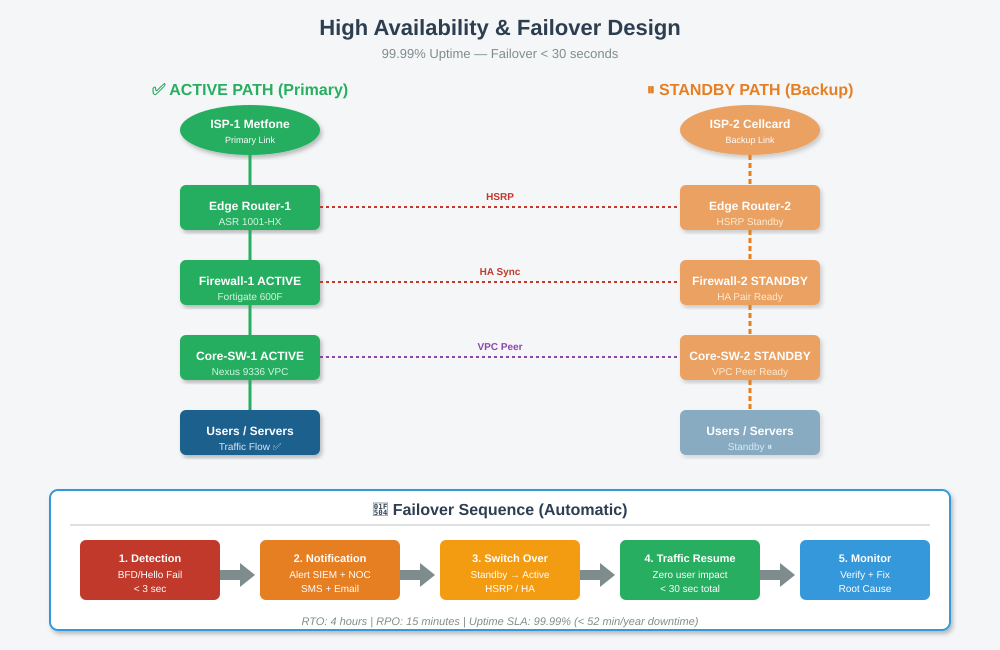

# 🔒 Network Security

[⬅ Back to Index](index.md)

---

## 🛡️ Defense in Depth (សុវត្ថិភាពច្រើនស្រទាប់)



**គោលការណ៍**: ការពារច្រើនស្រទាប់ — បើ Layer មួយបរាជ័យ, Layer បន្ទាប់នៅតែការពារ។

---

## 🛠️ Basic Security Tools

| ស្រទាប់ | ដំណោះស្រាយ | មុខងារ |
|--------|------------|--------|
| **Perimeter** | Firewall (Cisco ASA) | Block Attacks from Internet |
| **Network** | VLAN + ACL | Segment Traffic |
| **Endpoint** | Antivirus | Block Malware |
| **User** | Password + 2FA | User Authentication |
| **Data** | Encryption (HTTPS, VPN) | Protect Data in Transit |

---

## 🔥 Firewall Rules (Basic)

### Zone-Based Policy:

| Source | Destination | Allow / Deny |
|--------|-------------|--------------|
| Internet | DMZ (Web) | ✅ Allow HTTP/HTTPS |
| Internet | Internal Server | ❌ Deny All |
| Staff | Server | ✅ Allow specific |
| Guest | Internal | ❌ Deny All |
| Guest | Internet | ✅ Allow Web only |

---

## 🔐 Access Control List (ACL)

**ACL** = បញ្ជីច្បាប់ (Rules) សម្រាប់អនុញ្ញាត/បដិសេធ Traffic។

### Example: ACL សម្រាប់ Guest VLAN
```cisco
Router(config)# ip access-list extended GUEST_ACL
Router(config-ext-nacl)# deny ip any 192.168.10.0 0.0.0.255
Router(config-ext-nacl)# deny ip any 192.168.20.0 0.0.0.255
Router(config-ext-nacl)# permit ip any any
Router(config-ext-nacl)# exit

Router(config)# interface vlan 40
Router(config-if)# ip access-group GUEST_ACL in
```

**មានន័យថា**: Guest មិនអាចទៅ Staff (10) ឬ Server (20) បានទេ, ប៉ុន្តែអាចទៅ Internet។

---

## 📋 Security Best Practices

1. 🔐 **Strong Password** — យ៉ាងតិច ១២ តួ, mix letters/numbers/symbols
2. 🔒 **Change Default Password** — សម្រាប់គ្រប់ឧបករណ៍
3. 🚪 **Disable Unused Ports** — កាត់បន្ថយ Attack Surface
4. 📝 **Enable Logging** — មើលឃើញ Suspicious Activity
5. 🔄 **Regular Updates** — Firmware, Antivirus
6. 💾 **Backup ជាទៀងទាត់** — សម្រាប់ Disaster Recovery
7. 👥 **User Training** — បណ្តុះបណ្តាលបុគ្គលិកអំពី Phishing

---

## 🔄 High Availability (Backup Design)



- **Dual Power** — UPS + Generator
- **Dual Internet** — Primary + Backup 4G
- **Backup Server** — សម្រាប់ Disaster Recovery

---

## 🚨 Incident Response (សំរាប់ចាប់ផ្តើម)

```
Detection (រកឃើញបញ្ហា)
    ↓
Containment (បំបែកបញ្ហា)
    ↓
Removal (ដកបញ្ហាចេញ)
    ↓
Recovery (សង្គ្រោះប្រព័ន្ធ)
    ↓
Report (រៀបចំរបាយការណ៍)
```

---

## 🎓 សំណួរសម្រាប់និស្សិត

1. តើ Firewall ធ្វើអ្វី?
2. VLAN ជួយសុវត្ថិភាពយ៉ាងណា?
3. ហេតុអ្វី Password ខ្លាំងសំខាន់?
4. What is IPsec VPN?

---

[⬅ Prev: Equipment](11_equipment.md) | [Index](index.md) | [Next: Implementation ➡](13_implementation.md)
