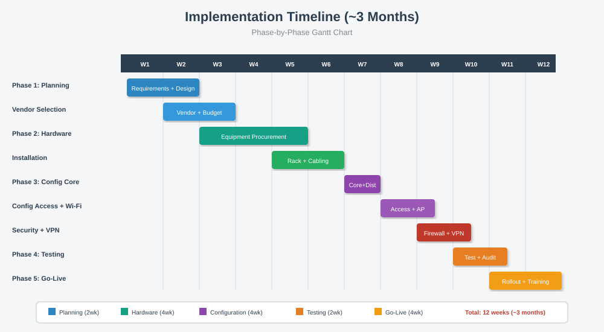

# 📅 Implementation Timeline

[⬅ Back to Index](index.md)

---

## 🗓️ Project Timeline (~2 ខែ)



---

## 📋 ជំហានទី ១ - Planning (សប្តាហ៍ 1-2)

### អ្វីត្រូវធ្វើ:
- ✅ ប្រមូលតម្រូវការ (Requirements Gathering)
- ✅ រៀបចំ Network Diagram (Logical & Physical)
- ✅ ជ្រើសរើសឧបករណ៍
- ✅ រៀបចំថវិកា (Budget)

### Deliverables:
- 📄 Network Design Document
- 📄 Bill of Materials (BoM)

---

## 📋 ជំហានទី ២ - Hardware (សប្តាហ៍ 3-4)

### អ្វីត្រូវធ្វើ:
- ✅ ទិញឧបករណ៍ (Router, Switch, Server)
- ✅ តំឡើងឧបករណ៍នៅ Server Room
- ✅ ដំឡើងខ្សែ (Cat6, Fiber)
- ✅ ដំឡើង UPS + AC

---

## 📋 ជំហានទី ៣ - Configuration (សប្តាហ៍ 5-6)

### Head Office
```
1. Configure Router (WAN + LAN)
2. Configure Firewall
3. Configure Core Switch (VLAN + Inter-VLAN Routing)
4. Configure Access Switches
5. Setup Server (File, DNS, Web)
```

### Branches
```
1. Configure Branch Router
2. Setup VPN to HO
3. Configure Local Switch
4. Test connectivity
```

---

## 📋 ជំហានទី ៤ - Testing (សប្តាហ៍ 7)

### Basic Tests:
- ✅ **Ping Test** — គ្រប់ Device
- ✅ **Traceroute** — មើលផ្លូវ Packet
- ✅ **Web Access** — សាកល្បង Internet
- ✅ **VPN Test** — សាកល្បងភ្ជាប់ Branch
- ✅ **Security Scan** — មើល Vulnerabilities

---

## 📋 ជំហានទី ៥ - Go-Live (សប្តាហ៍ 8)

### អ្វីត្រូវធ្វើ:
- ✅ Migration ពី Old System (បើមាន)
- ✅ បណ្តុះបណ្តាលបុគ្គលិក (Training)
- ✅ ផ្ដល់ Documentation ឲ្យ IT Team
- ✅ Handover និង Support

---

## 👥 Project Team

| Role | Responsibility |
|------|----------------|
| **Project Manager** | គ្រប់គ្រងកាលវិភាគ |
| **Network Engineer** | Design + Configuration |
| **Server Admin** | Server Setup |
| **Field Engineer** | ដំឡើងឧបករណ៍នៅសាខា |
| **Trainer** | បណ្តុះបណ្តាលបុគ្គលិក |

---

## ⚠️ Risk Management

| Risk | Mitigation |
|------|------------|
| Equipment Delay | Order Buffer 2 weeks |
| Configuration Error | Test in Packet Tracer first |
| Cable Issues | Use certified installer |
| Downtime | Weekend migration |

---

[⬅ Prev: Security](12_security.md) | [Index](index.md) | [Next: Testing ➡](14_testing.md)
